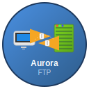

# AuroraFTP

<p align="center">
  
</p>

<p align="center">
  <strong>A modern, secure, and user-friendly FTP/SFTP client for Linux</strong>
</p>

<p align="center">
  
  
  
</p>

A modern, clean FTP/SFTP client built with Python and PyQt6, designed for Linux users who need secure file transfer capabilities with professional features.

## ✨ Features

🚀 **Modern Interface**
- Clean, intuitive dual-pane file browser
- Tabbed connections for managing multiple servers
- Real-time transfer progress with queue management
- Drag-and-drop file operations

🔒 **Security First**
- Secure credential storage using system keyring
- SFTP with SSH host key verification
- FTPS (FTP over SSL/TLS) support
- No plaintext password storage

⚡ **High Performance**
- Asynchronous architecture with asyncio
- Multi-threaded file transfers
- Resume interrupted transfers
- Background operations without UI blocking

🌐 **Protocol Support**
- **FTP** - Standard File Transfer Protocol
- **FTPS** - FTP over SSL/TLS (both explicit and implicit)
- **SFTP** - SSH File Transfer Protocol

🔧 **Advanced Features**
- Site manager with connection profiles
- Folder synchronization
- File permissions management
- Transfer queue with retry logic
- Comprehensive logging

## 📦 Installation

### Recommended: Download Pre-built Package

Download the latest release directly from GitHub:

```bash
# Download the .deb package
wget https://github.com/rmc0315/auroraftp/releases/download/0.1.0.1/auroraftp_0.1.0.1.deb

# Install on Debian/Ubuntu systems
sudo dpkg -i auroraftp_0.1.0.1.deb

# Fix any missing dependencies (if needed)
sudo apt-get install -f
```

**Alternative Download Options:**
- **Direct .deb**: https://github.com/rmc0315/auroraftp/releases/download/0.1.0.1/auroraftp_0.1.0.1.deb
- **Source tarball**: https://github.com/rmc0315/auroraftp/releases/download/0.1.0.1/auroraftp_0.1.0.1.tar.xz
- **Source ZIP**: https://github.com/rmc0315/auroraftp/archive/refs/tags/0.1.0.1.zip
- **Source tar.gz**: https://github.com/rmc0315/auroraftp/archive/refs/tags/0.1.0.1.tar.gz

### Install from Source (Development)

For developers or users who want to build from source:

```bash
# Clone the repository
git clone https://github.com/rmc0315/auroraftp.git
cd auroraftp

# Install system dependencies
sudo apt update
sudo apt install python3 python3-pip python3-venv python3-pyqt6 openssh-client

# Create virtual environment
python3 -m venv venv
source venv/bin/activate

# Install AuroraFTP
pip install -e .
```

### Build Your Own Packages

You can also build packages locally using the included scripts:

```bash
# Build enhanced .deb package (recommended)
./scripts/make_deb_auto_deps.sh

# Build portable AppImage
./scripts/make_appimage_standalone.sh

# All built packages will be in the dist/ directory
```

### Future Installation Methods

*Coming soon:*

- **PyPI Package**: `pip install auroraftp` 
- **Official Debian Repository**: `apt install auroraftp`

## Usage

### Launch the Application

After installation from source:

```bash
# From the project directory with venv activated
python -m auroraftp.app

# Or use the development script
./scripts/run_dev.sh
```

After installing a built package:

```bash
# If installed via .deb package
auroraftp

# Or from desktop environment
# Look for "AuroraFTP" in your applications menu
```

### Command Line Interface

*Note: Full CLI functionality is planned for future releases.*

### First Run

1. Launch AuroraFTP
2. Use the Site Manager to add your first connection
3. Enter connection details (host, username, authentication)
4. Test the connection and save
5. Connect and start transferring files!

## Development

### Setup

```bash
# Clone the repository
git clone https://github.com/rmc0315/auroraftp.git
cd auroraftp

# Create virtual environment
python3 -m venv venv
source venv/bin/activate

# Install development dependencies
pip install -e .
pip install pytest pytest-qt pytest-asyncio ruff mypy pre-commit

# Set up pre-commit hooks (optional)
pre-commit install
```

### Running

```bash
# Development mode
python -m auroraftp.app

# Or use the script
./scripts/run_dev.sh
```

### Testing

```bash
# Run unit tests only
pytest tests/unit -v

# Run with coverage
pytest tests/unit --cov=auroraftp --cov-report=html

# Run integration tests (requires Docker)
./scripts/run_tests.sh --integration

# Run all tests with coverage
./scripts/run_tests.sh --integration --coverage
```

### Building Packages

```bash
# Build enhanced standalone .deb package (recommended)
./scripts/make_deb_auto_deps.sh

# Build portable AppImage
./scripts/make_appimage_standalone.sh

# Build basic .deb package
./scripts/make_deb_native.sh

# All built packages will be in the dist/ directory
```

## Configuration

Configuration files are stored in:
- Linux: `~/.config/auroraftp/`
- Config: `config.json`
- Logs: `logs/auroraftp.log`
- Credentials: System keyring or encrypted storage

## Keyboard Shortcuts

- `Ctrl+T`: New Tab
- `Ctrl+W`: Close Tab
- `Ctrl+Enter`: Connect
- `Ctrl+D`: Disconnect
- `F5`: Refresh
- `Ctrl+H`: Toggle Hidden Files
- `Ctrl+N`: New Folder
- `F2`: Rename
- `Del`: Delete
- `Space`: Pause/Resume Transfer
- `Ctrl+R`: Retry Failed Transfers
- `Ctrl+K`: Clear Completed Transfers

## Security

- Credentials stored securely using system keyring
- SSH host key verification with fingerprint prompts
- TLS/SSL support with configurable cipher suites
- No plaintext password storage
- Audit logs without sensitive information

## License

MIT License - see [LICENSE](LICENSE) for details.

## Contributing

See [CONTRIBUTING.md](CONTRIBUTING.md) for development guidelines.

## 📋 Roadmap

### Version 1.0 (Current Development)
- ✅ Core FTP/FTPS/SFTP functionality
- ✅ Secure credential storage
- ✅ Dual-pane file browser
- ✅ Transfer queue management
- ✅ Professional packaging

### Future Versions
- 🔄 Advanced folder synchronization
- 🌐 Cloud storage integration
- 🎨 Theme customization
- 🔧 Plugin system
- 📱 Mobile companion app

## 🤝 Contributing

We welcome contributions! Please see [CONTRIBUTING.md](CONTRIBUTING.md) for guidelines on:

- Setting up the development environment
- Code style and quality requirements  
- Testing procedures
- Submitting pull requests

## 📄 License

This project is licensed under the MIT License - see the [LICENSE](LICENSE) file for details.

## 🔗 Links

- **Source Code**: https://github.com/rmc0315/auroraftp
- **Issues**: Report bugs and request features on GitHub Issues
- **Releases**: Check GitHub Releases for latest packages and updates

## 📞 Support

For support and questions:

1. **GitHub Issues**: Report bugs or request features at https://github.com/rmc0315/auroraftp/issues
2. **Search Existing Issues**: Check if your question has already been answered
3. **Contact the Author**: Reach out via GitHub (@rmc0315) for direct communication

**Need Help?** Create a new GitHub Issue with:
- Your Linux distribution and version
- AuroraFTP version (if installed)
- Steps to reproduce the problem
- Any error messages or logs

**Feature Requests Welcome!** Use GitHub Issues to suggest new features or improvements.

---

<p align="center">
  Made with ❤️ for the Linux community
</p>